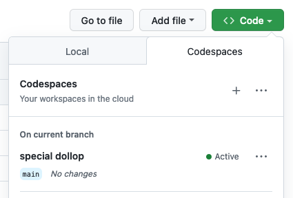
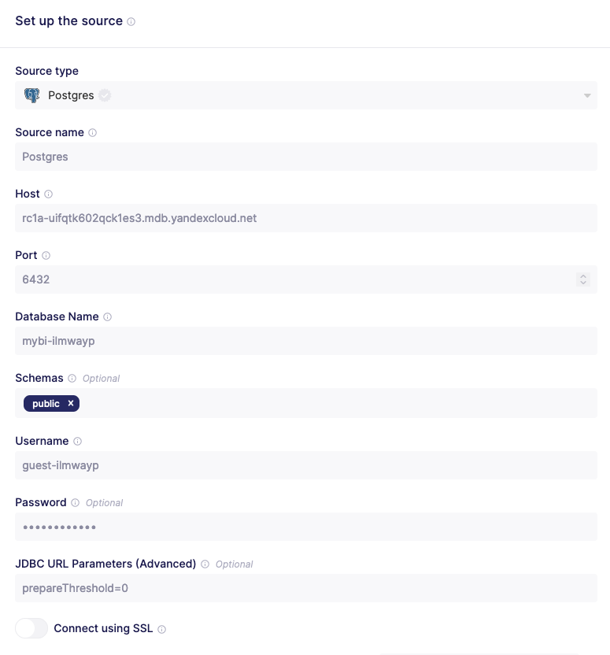
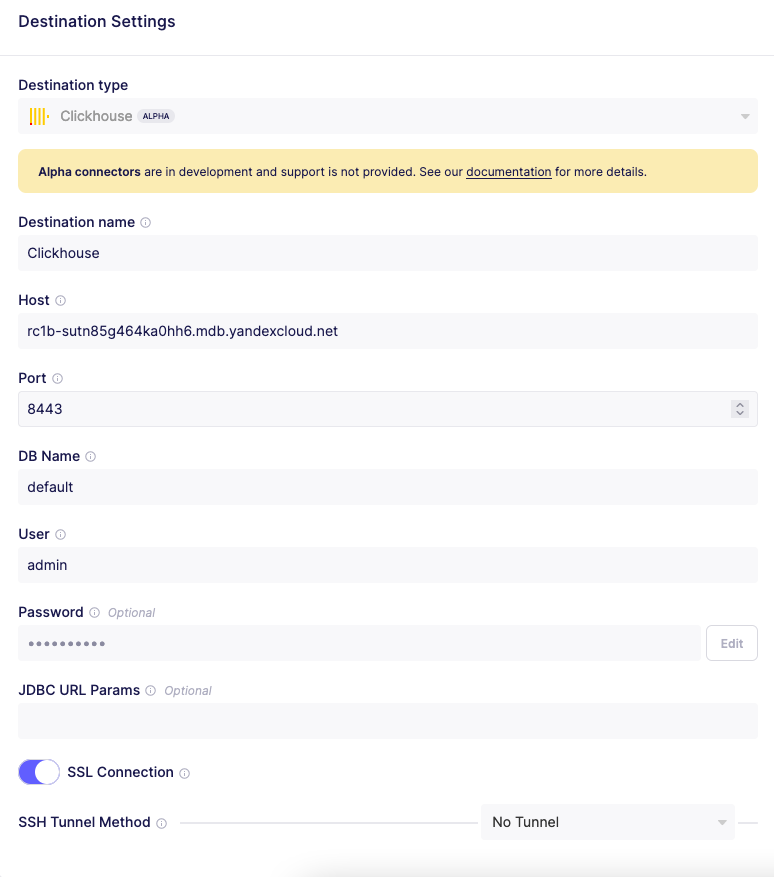
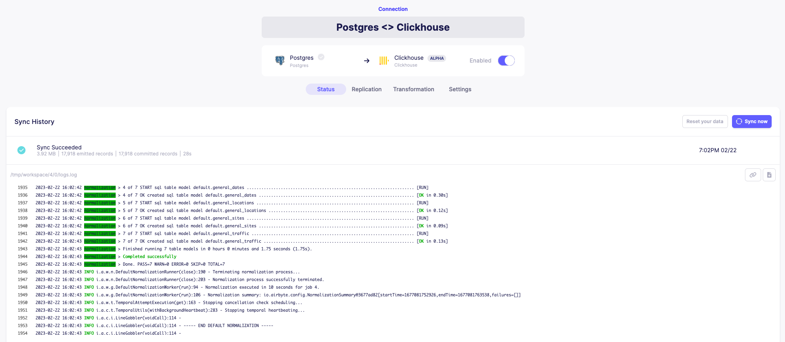

# Setting up Airbyte Data Pipelines Labs

- Build DWH powered by [Clickhouse](https://clickhouse.com/) and [dbt](https://www.getdbt.com/)
- Deploy Infrastructure as Code with [Terraform](https://www.terraform.io/) and [Yandex.Cloud](https://cloud.yandex.com/en-ru/)
- Instant development with [Github Codespaces](https://docs.github.com/en/codespaces)
- Assignment checks with [Github Actions](https://github.com/features/actions)

## Assignment TODO

⚠️ Attention! Always delete resources after you finish your work!

- [ ] [Fork this repository](https://docs.github.com/en/get-started/quickstart/fork-a-repo)
- [ ] [Configure Developer Environment]()
- [ ] [Deploy Infrastructure with Terraform]()
- [ ] [Deploy Airbyte]()
- [ ] [Configure Data Pipelines]()
- [ ] [Create PR and make CI tests pass]()

- [ ] IaC (Terraform): 
    - [x] S3 Bucket
    - [x] VM
    - [x] Clickhouse
- [ ] Install Airbyte on VM (Packer, Vagrant?)
    - [ ] Will this image be working on another YC account / folder?
- [ ] Access Airbyte through Web UI
- [ ] Configure Pipelines
	- [ ] Postgres to Clickhouse
	- [ ] Postgres to S3
- [ ] Test assignment with Github Actions
	- [ ] Query files on S3 with Clickhouse S3 table engine

## 1. Configure Developer Environment

You have 2 options to set up:
 
<details><summary>Start with GitHub Codespaces:</summary>
<p>



</p>
</details>

<details><summary>Install dbt environment with Docker:</summary>
<p>

Install [Docker](https://docs.docker.com/desktop/#download-and-install) and run commands:

```bash
# build & run container
docker-compose build
docker-compose up -d

# alias docker exec command
alias dbt="docker-compose exec dev dbt"
```

</p>
</details>

## 2. Deploy Infrastructure


1. Install and configure `yc` CLI: [Getting started with the command-line interface by Yandex Cloud](https://cloud.yandex.com/en/docs/cli/quickstart#install)

    ```bash
    yc init
    ```

1. Populate `.env` file

    `.env` is used to store secrets as environment variables.

    Copy template file [.env.template](./.env.template) to `.env` file:
    ```bash
    cp .env.template .env
    ```

    Open file in editor and set your own values.

    > ❗️ Never commit secrets to git    

1. Set environment variables:

    ```bash
    export YC_TOKEN=$(yc iam create-token)
    export YC_CLOUD_ID=$(yc config get cloud-id)
    export YC_FOLDER_ID=$(yc config get folder-id)
    export TF_VAR_folder_id=$(yc config get folder-id)
    export $(xargs < .env)

    ## DEBUG
    # export TF_LOG_PATH=./terraform.log
    # export TF_LOG=trace
    ```

1. Deploy using Terraform

    Get familiar with Cloud Infrastructure: [main.tf](./main.tf) and [variables.tf](./variables.tf)

    ```bash
    terraform init
    terraform validate
    terraform fmt
    terraform plan
    terraform apply
    ```

    Store terraform output values as Environment Variables:

    ```bash
    export CLICKHOUSE_HOST=$(terraform output -raw clickhouse_host_fqdn)
    export DBT_HOST=${CLICKHOUSE_HOST}
    export DBT_USER=${CLICKHOUSE_USER}
    export DBT_PASSWORD=${TF_VAR_clickhouse_password}
    ```

    [EN] Reference: [Getting started with Terraform by Yandex Cloud](https://cloud.yandex.com/en/docs/tutorials/infrastructure-management/terraform-quickstart)
    
    [RU] Reference: [Начало работы с Terraform by Yandex Cloud](https://cloud.yandex.ru/docs/tutorials/infrastructure-management/terraform-quickstart)

## 3. Deploy Airbyte

1. Get VM's public IP:

    ```bash
    terraform output -raw yandex_compute_instance_nat_ip_address
    ```

2. Lab's VM image already has Airbyte installed. However if you'd like to do it yourself: 

    ```bash
    ssh airbyte@{yandex_compute_instance_nat_ip_address}

    sudo mkdir airbyte && cd airbyte
    sudo wget https://raw.githubusercontent.com/airbytehq/airbyte-platform/main/{.env,flags.yml,docker-compose.yaml}
    sudo docker-compose up -d
    ```

3. Access UI at {yandex_compute_instance_nat_ip_address}:8000

    With credentials:

    ```
    airbyte
    password
    ```

    
## 4. Configure Data Pipelines

1. Configure Postgres Source

    Get database credentials: https://github.com/kzzzr/mybi-dbt-showcase/blob/main/dbt_project.yml#L31-L36

    ❗️ Supply JDBC URL Parameter: `prepareThreshold=0`

    

1. Configure Clickhouse Destination

    

1. Configure S3 Destination

    Gather key pair:

    ```bash
    terraform output -raw yandex_iam_service_account_static_access_key
    terraform output -raw yandex_iam_service_account_static_secret_key
    ```

    Make sure you choose S3 Bucket Path = `mybi`

    

    ❗️ Set Destination Connector S3 version to `0.1.16`. Otherwise you will get errors with Yandex.Cloud Object Storage.

    

1. Sync data to Clickhouse Destination

    Only sync tables with `general_` prefix.

    
    
    

1. Sync data to S3 Destination

    Only sync tables with `general_` prefix.

    
    
    

## 5. Create PR and make CI tests pass

Since you have synced data to S3 bucket with public access, this data now should be available as Clickhouse External Table.

Set VARIABLE.

Let's make sure it works:

```bash
dbt debug
dbt test
```

If it works for you, open PR and see if CI tests pass.


----------


1. Install dbt packages

    ```bash
    dbt deps
    ```

1. Stage data sources with dbt macro

    Source data will be staged as EXTERNAL TABLES (S3) using dbt macro [init_s3_sources](./macros/init_s3_sources.sql):

    ```bash
    dbt run-operation init_s3_sources
    ```

    Statements will be run separately from a list to avoid error:

    ```
    DB::Exception: Syntax error (Multi-statements are not allowed)
    ```

1. Describe sources in [sources.yml](./models/sources/sources.yml) files

## Shut down your cluster

⚠️ Attention! Always delete resources after you finish your work!


```bash
terraform destroy
```
